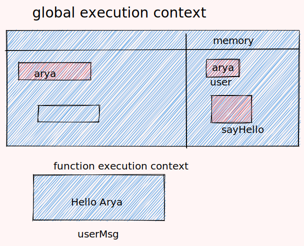
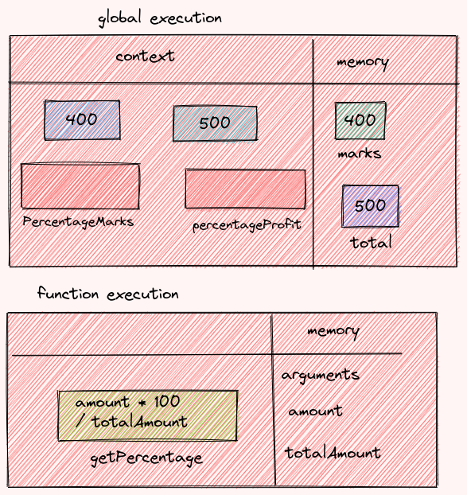
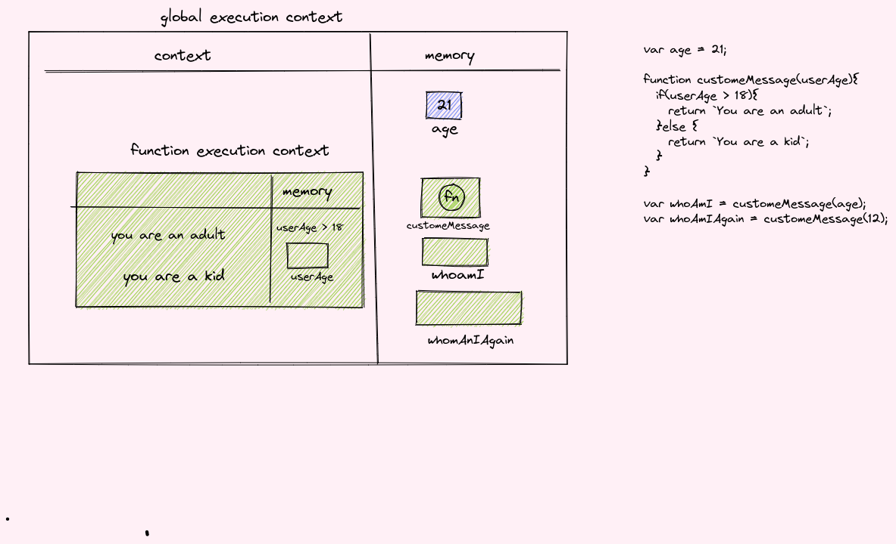

1. What does thread of execution means in JavaScript?

understanding  to execute only a single set of instructions at any time in the process.

2. Where the JavaScript code gets executed?

JavaScript can execute not only in the browser, but also on the server, or actually on any device that has a special program called the JavaScript engine.

3. What does context means in Global Execution Context?

 Global Execution Context (GEC) . The GEC is the base/default Execution Context where all JavaScript code that is not inside of a function gets executed.


4. When do you create a global execution context.
when the javascript engine starts execution that time global execution context created

5. Execution context consists of what all things?
contains the variables scope and the functions  prototype and also the memory where the declared value gets stored


6. What are the different types of execution context?
1. global execution context
2. function exection context

7. When global and function execution context gets created?
when we run the js file , javascript engine get started then creates the global exceution part only one time for whole task until terminated and when we need the function to be executed then the function context wil be created again & again for each function


8. Function execution gets created during function execution or while declaring a function.
while declaring the function each arguments given are stored in the object based in the function context 

9. Create a execution context diagram of the following code on your notebook. Take a screenshot/photo and store it in the folder named `img`. Use `` to display it here.

```js
var user = "Arya";

function sayHello(){
  return `Hello ${user}`;
}

var userMsg = sayHello(user);
```

<!-- Put your image here -->




```js
var marks = 400;
var total = 500;

function getPercentage(amount, totalAmount){
  return (amount * 100) / totalAmount;
}

var percentageMarks = getPercentage(marks, total);
var percentageProfit = getPercentage(400, 200);
```

<!-- Put your image here -->




```js
var age = 21;

function customeMessage(userAge){
  if(userAge > 18){
    return `You are an adult`;
  }else {
    return `You are a kid`;
  }
}

var whoAmI = customeMessage(age);
var whoAmIAgain = customeMessage(12);
```

<!-- Put your image here -->

